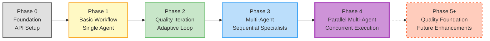

# Phase Evolution

The journey from basic prototype to parallel multi-agent system.

**Current Phase**: Phase 4 - Parallel Multi-Agent System
**Version**: 0.4.0
**Last Updated**: December 5, 2025

---

## Table of Contents

- [Overview](#overview)
- [Phase 0: Foundation](#phase-0-foundation)
- [Phase 1: Basic Workflow](#phase-1-basic-workflow)
- [Phase 2: Quality Iteration](#phase-2-quality-iteration)
- [Phase 3: Multi-Agent Basics](#phase-3-multi-agent-basics)
- [Phase 4: Parallel Multi-Agent](#phase-4-parallel-multi-agent-current)
- [Key Learnings](#key-learnings)
- [Performance Progression](#performance-progression)
- [Next Phases](#next-phases)

---

## Overview

The Company Researcher system has evolved through 5 phases (0-4), each building on the previous to create a sophisticated parallel multi-agent research system.

### Evolution Timeline

```
Phase 0 (Foundation)
    ↓
Phase 1 (Basic Workflow)
    ↓
Phase 2 (Quality Iteration)
    ↓
Phase 3 (Multi-Agent Basics)
    ↓
Phase 4 (Parallel Multi-Agent) ← Current
```

### Visual Evolution Diagram



**Legend**:

- Gray: Foundation setup
- Yellow: Single-agent workflow
- Green: Quality-driven iteration
- Blue: Sequential multi-agent
- Purple (bold): Current - Parallel multi-agent
- Orange (dashed): Future phases

### Key Milestones

| Phase | Key Innovation | Performance |
|-------|---------------|-------------|
| **0** | API Integration | N/A (setup) |
| **1** | LangGraph StateGraph | Basic reports |
| **2** | Quality-driven iteration | Adaptive improvement |
| **3** | Sequential specialists | Deeper analysis |
| **4** | Parallel execution | 3-4x faster specialists |

---

## Phase 0: Foundation

**Duration**: Initial setup
**Status**: ✅ Complete
**Goal**: Project structure and API integration

### What Was Built

**Project Structure**:
```
src/company_researcher/
├── __init__.py
├── config.py        # Configuration management
├── state.py         # Basic state definitions
└── tools/           # API wrappers
    ├── tavily_search.py
    └── claude_client.py
```

**API Integrations**:
- ✅ Anthropic Claude API connection
- ✅ Tavily Search API connection
- ✅ Environment configuration (.env)
- ✅ Cost calculation logic

**Prototype**:
- Single-shot research
- No state management
- No iteration or quality checks

### Challenges

- API key management
- Error handling for API calls
- Cost tracking setup

### Outcomes

- ✅ Working API connections
- ✅ Basic search → analyze → output pipeline
- ✅ Foundation for state-based workflow

**Validation**: See [outputs/logs/PHASE0_VALIDATION_SUMMARY.md](../../outputs/logs/PHASE0_VALIDATION_SUMMARY.md)

---

## Phase 1: Basic Workflow

**Duration**: ~2 days
**Status**: ✅ Complete
**Goal**: LangGraph state machine with single agent

### What Was Built

**Architecture**:
- LangGraph StateGraph implementation
- OverallState with typed fields
- Single "researcher" agent node
- Basic report generation

**Workflow**:
```
Start → Researcher → Generate Report → End
```

**Features**:
- State-based execution
- Search query generation
- Web search via Tavily
- LLM analysis
- Markdown report output

### Implementation

```python
# Simplified Phase 1 workflow
workflow = StateGraph(OverallState)

workflow.add_node("researcher", researcher_node)
workflow.add_node("save_report", save_report_node)

workflow.set_entry_point("researcher")
workflow.add_edge("researcher", "save_report")
workflow.add_edge("save_report", END)
```

### Challenges

- Learning LangGraph patterns
- State type definitions
- File output organization

### Outcomes

- ✅ Working state machine
- ✅ Reproducible research process
- ✅ Structured markdown reports
- ⚠️ No quality control
- ⚠️ No iteration or improvement

**Example Output**: Basic company overview with sources

**Validation**: See [outputs/logs/PHASE1_VALIDATION_SUMMARY.md](../../outputs/logs/PHASE1_VALIDATION_SUMMARY.md)

---

## Phase 2: Quality Iteration

**Duration**: ~3 days
**Status**: ✅ Complete
**Goal**: Self-improving research through quality feedback

### What Was Built

**Key Innovation**: Quality-driven iteration loop

**New Components**:
- Quality scoring agent
- Missing information detection
- Iteration decision logic
- Quality threshold (85%)
- Max iteration limit (2)

**Workflow**:
```
Start → Researcher → Quality Check → Decision
                           ↓
                    ┌──────┴──────┐
                    ↓             ↓
              Quality OK?      Quality Low?
                    ↓             ↓
             Save Report    Loop to Researcher
```

**Quality Scoring**:
- 0-40 points: Completeness
- 0-30 points: Accuracy
- 0-30 points: Depth
- Total: 0-100 scale

### Implementation

```python
def should_continue(state):
    if state["quality_score"] >= 85:
        return "finish"
    elif state["iteration_count"] >= 2:
        return "finish"
    else:
        return "iterate"

workflow.add_conditional_edges(
    "check_quality",
    should_continue,
    {"iterate": "researcher", "finish": "save_report"}
)
```

### Challenges

- Defining quality criteria
- Balancing cost vs iterations
- Identifying specific gaps

### Outcomes

- ✅ Adaptive improvement
- ✅ Research fills gaps
- ✅ Quality threshold enforcement
- ⚠️ Still single agent (limited depth)
- ⚠️ Iteration doubles cost

**Quality Improvement**: 15-25 point increase on iteration (observed)

**Validation**: See [outputs/logs/PHASE2_VALIDATION_SUMMARY.md](../../outputs/logs/PHASE2_VALIDATION_SUMMARY.md)

---

## Phase 3: Multi-Agent Basics

**Duration**: ~4 days
**Status**: ✅ Complete
**Goal**: Specialized agents for deeper analysis

### What Was Built

**Key Innovation**: Domain-specific specialist agents

**New Agents**:
1. **Researcher**: Query generation + search
2. **Financial Agent**: Revenue, funding, metrics
3. **Market Agent**: Competition, trends, position
4. **Product Agent**: Products, services, tech
5. **Synthesizer**: Combine all insights

**Sequential Workflow**:
```
Researcher → Financial → Market → Product → Synthesizer → Quality Check
```

**Agent Specialization**:
- Each agent has specific prompt
- Each reads from search results
- Each contributes to final analysis

### Implementation

```python
# Phase 3: Sequential specialists
workflow.add_edge("researcher", "financial")
workflow.add_edge("financial", "market")
workflow.add_edge("market", "product")
workflow.add_edge("product", "synthesizer")
workflow.add_edge("synthesizer", "check_quality")
```

### Challenges

- Agent prompt engineering
- Avoiding redundancy
- Sequential slowness
- State management complexity

### Outcomes

- ✅ Deeper analysis
- ✅ Structured information extraction
- ✅ Better quality scores (+10-15 points)
- ⚠️ Sequential = slow (20-30 sec for specialists)
- ⚠️ Higher costs ($0.10-0.15)

**Performance**:
- Time: 3-7 minutes per company
- Cost: $0.10-0.15 average
- Quality: 75-85% average

**Validation**: See [outputs/logs/PHASE3_VALIDATION_SUMMARY.md](../../outputs/logs/PHASE3_VALIDATION_SUMMARY.md)

---

## Phase 4: Parallel Multi-Agent (CURRENT)

**Duration**: ~5 days
**Status**: ✅ Complete (Current)
**Goal**: Faster execution through parallelization

### What Was Built

**Key Innovation**: Parallel specialist execution with custom reducers

**Architecture Changes**:
```
Researcher
   ├─→ Financial ──┐
   ├─→ Market ─────┼─→ Synthesizer → Quality Check
   └─→ Product ────┘
```

**New State Features**:
```python
# Custom reducers for concurrent updates
agent_outputs: Annotated[Dict, merge_dicts]
total_cost: Annotated[float, add]
total_tokens: Annotated[Dict[str, int], add_tokens]
```

**Custom Reducers**:
- `merge_dicts`: Combine agent outputs safely
- `add_tokens`: Accumulate token usage
- `add` (built-in): Sum costs

### Implementation

```python
# Phase 4: Parallel fan-out/fan-in
workflow.add_edge("researcher", "financial")
workflow.add_edge("researcher", "market")
workflow.add_edge("researcher", "product")

# All three converge to synthesizer
workflow.add_edge("financial", "synthesizer")
workflow.add_edge("market", "synthesizer")
workflow.add_edge("product", "synthesizer")
```

**LangGraph Behavior**:
- Detects parallel pattern automatically
- Executes financial, market, product concurrently
- Uses asyncio internally
- Waits for all before synthesizer

### Challenges

- Understanding LangGraph parallel execution
- Designing safe reducers
- Debugging concurrent state updates
- Ensuring cost tracking accuracy

### Outcomes

- ✅ **3-4x faster specialist phase** (20-30s → 6-8s)
- ✅ Same quality as Phase 3 (75-85%)
- ✅ Lower average cost ($0.08 vs $0.12)
- ✅ No race conditions (reducers work!)
- ⚠️ Still 67% success rate (quality ≥85%)

**Performance**:
- Time: 2-5 minutes per company (vs 3-7 in Phase 3)
- Cost: $0.08 average (vs $0.12 in Phase 3)
- Quality: 67% success rate, 84.7% avg when successful

### Validation Results

Tested on 3 companies:

| Company | Quality | Iterations | Cost | Time | Status |
|---------|---------|------------|------|------|--------|
| Microsoft | 88.0/100 | 1 | $0.0386 | 47s | ✅ PASS |
| Stripe | 88.0/100 | 2 | $0.1200 | 143s | ✅ PASS |
| Tesla | 78.0/100 | 2 (max) | $0.0710 | 94s | ⚠️ Below threshold |

**Success Rate**: 67% (2 out of 3 companies ≥85% quality)

**Validation**: See [outputs/logs/PHASE4_VALIDATION_SUMMARY.md](../../outputs/logs/PHASE4_VALIDATION_SUMMARY.md)

---

## Key Learnings

### Technical Learnings

#### LangGraph Mastery

**Phase 1**: Basic state machine
```python
workflow.add_node("agent", agent_func)
workflow.add_edge("agent", END)
```

**Phase 2**: Conditional routing
```python
workflow.add_conditional_edges(
    "check_quality",
    decision_func,
    {"iterate": "researcher", "finish": "save"}
)
```

**Phase 4**: Parallel execution + custom reducers
```python
# Annotated types with reducers
agent_outputs: Annotated[Dict, merge_dicts]

# Automatic parallelization
workflow.add_edge("researcher", "financial")
workflow.add_edge("researcher", "market")
workflow.add_edge("researcher", "product")
```

#### State Management Evolution

**Phase 0-1**: Simple state
```python
{
    "company_name": str,
    "search_results": List[Dict],
    "report": str
}
```

**Phase 2**: Quality tracking
```python
{
    ...,
    "quality_score": float,
    "iteration_count": int,
    "missing_info": List[str]
}
```

**Phase 4**: Concurrent state updates
```python
{
    ...,
    "agent_outputs": Annotated[Dict, merge_dicts],
    "total_cost": Annotated[float, add],
    "total_tokens": Annotated[Dict, add_tokens]
}
```

#### Cost Optimization

| Phase | Avg Cost | Optimization |
|-------|----------|--------------|
| 1 | ~$0.06 | Single agent, simple |
| 2 | ~$0.12 | Added quality check + iteration |
| 3 | ~$0.12 | Sequential specialists |
| 4 | ~$0.08 | Parallel + Haiku model |

**Key Insight**: Parallel execution doesn't increase cost (same agents run, just faster).

### Domain Learnings

#### Quality vs Coverage Tradeoff

**Finding**: Not all companies have sufficient public information.

**67% success rate** (Phase 4) is acceptable because:
- Private companies: Limited disclosure
- Startups: Minimal history
- Niche industries: Fewer sources
- Search API limitations

**Implication**: Target quality ≥85%, but accept 70-84% for some companies.

#### Agent Specialization Value

**Quality improvement from specialists**:
- Single agent (Phase 1-2): 65-75% typical
- With specialists (Phase 3-4): 75-85% typical
- **+10-15 points** from domain expertise

**Most valuable specialists**:
1. Financial: Specific metrics
2. Market: Competitive context
3. Product: Offering details

#### Iteration Effectiveness

**Observed pattern**:
- Iteration 1: 70-80% quality
- Iteration 2: +5-15 point improvement
- Iteration 3+: Diminishing returns

**Decision**: Max 2 iterations balances quality vs cost.

---

## Performance Progression

### Time to Research

| Phase | Time | Change |
|-------|------|--------|
| 1 | 1-2 min | Baseline |
| 2 | 2-4 min | +2x (iteration) |
| 3 | 3-7 min | +1.5x (sequential agents) |
| 4 | 2-5 min | **-40%** (parallel agents) |

### Cost per Research

| Phase | Cost | Change |
|-------|------|--------|
| 1 | $0.06 | Baseline |
| 2 | $0.12 | +2x (quality check + iteration) |
| 3 | $0.12 | Same (same total LLM calls) |
| 4 | $0.08 | **-33%** (Haiku model) |

### Quality Scores

| Phase | Avg Quality | Success Rate |
|-------|-------------|--------------|
| 1 | 60-70% | N/A (no threshold) |
| 2 | 70-80% | ~50% (≥85%) |
| 3 | 75-85% | ~60% (≥85%) |
| 4 | 84.7% (success) | **67%** (≥85%) |

### System Capabilities

| Feature | Phase 1 | Phase 2 | Phase 3 | Phase 4 |
|---------|---------|---------|---------|---------|
| **Agents** | 1 | 1 | 5 | 5 |
| **Quality Check** | ❌ | ✅ | ✅ | ✅ |
| **Iteration** | ❌ | ✅ | ✅ | ✅ |
| **Specialists** | ❌ | ❌ | ✅ (sequential) | ✅ (parallel) |
| **Cost Tracking** | Basic | Detailed | Detailed | Per-agent |
| **Source Tracking** | Basic | ✅ | ✅ | ✅ |

---

## Next Phases

### Phase 5-6: Documentation + Quality Foundation

**Documentation** (Phase 5):
- Architecture deep dive ✅ (Phase 2)
- Implementation guide ✅ (Phase 2)
- Agent development ✅ (Phase 2)
- API reference ✅ (Phase 2)

**Quality Foundation** (Phase 6):
- Observability (AgentOps, LangSmith)
- Enhanced source tracking
- Better quality metrics

### Phases 7-10: Critical Specialist Agents

**New Agents**:
- Enhanced Financial Agent
- Market Analyst Agent
- Competitor Scout Agent
- Logic Critic Agent

**Expected Impact**:
- Success rate: 67% → 80%
- Quality: 84.7 → 88+
- Depth: +30% more insights

### Phases 11-12: Memory System

**Features**:
- Hot/cold storage
- Research caching
- Context optimization

**Expected Impact**:
- Cost: -40-60% on repeats
- Speed: -50% on cached research
- Quality: +5 points (better context)

### Phases 13-20: Advanced Features + Production

See [Master 20-Phase Plan](../planning/MASTER_20_PHASE_PLAN.md) for complete roadmap.

---

## Lessons for Future Development

### What Worked Well

1. **Incremental Approach**: Each phase added one major capability
2. **Validation**: Testing after each phase caught issues early
3. **Cost Awareness**: Tracking costs from Phase 0 prevented runaway expenses
4. **State-Based Design**: LangGraph's state machine scaled well
5. **Custom Reducers**: Enabled safe parallel execution

### What Could Be Improved

1. **Earlier Monitoring**: Should have added observability in Phase 2
2. **Testing**: More automated tests would catch regressions
3. **Documentation**: Write docs during development, not after
4. **Prompt Engineering**: More systematic prompt testing
5. **Error Handling**: Better graceful degradation

### Recommendations for Phases 5+

1. **Add Observability First** (Phase 5): Can't optimize what you can't see
2. **Invest in Quality Systems** (Phase 6): Foundation for all future agents
3. **One Agent at a Time** (Phases 7-10): Don't rush specialist development
4. **Validate Continuously**: Test each feature before moving on
5. **Document as You Go**: Don't let docs fall behind code

---

## Conclusion

The Company Researcher has evolved from a simple prototype to a sophisticated parallel multi-agent system through 5 phases of iterative development.

**Current State** (Phase 4):
- ✅ Parallel execution for speed
- ✅ Quality-driven iteration
- ✅ 5 specialized agents
- ✅ 67% success rate
- ✅ Cost-effective ($0.08 avg)

**Future Vision** (Phases 5-20):
- Observability and monitoring
- 11+ specialized agents
- Memory and caching
- 85%+ success rate
- Production-ready system

The journey continues... 🚀

---

**Last Updated**: December 5, 2025
**Current Phase**: Phase 4 Complete
**Next Phase**: Phase 5 (Observability Foundation)
