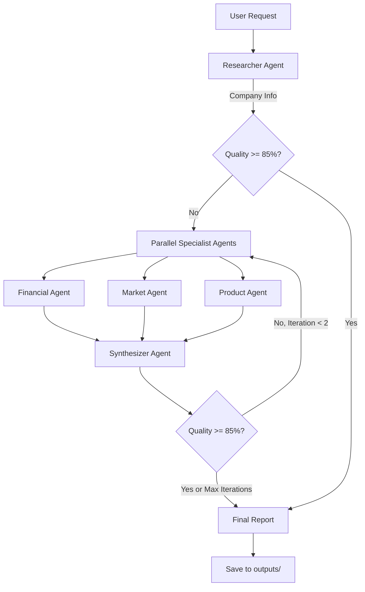

# Company Researcher - Multi-Agent Research System

AI-powered company research using specialized agents running in parallel.

**Status**: Phase 4 Complete - Parallel Multi-Agent System
**Version**: 0.4.0
**Last Updated**: December 5, 2025

---

## What It Does

The system researches **companies and general topics** using web search, news, GitHub discovery, and AI synthesis, delivering citation-backed reports in minutes.

**Key Features**:
- **5 Specialized Agents** running in parallel: Researcher, Financial, Market, Product, Synthesizer
- **Quality-Driven Iteration**: Automatically improves until 85%+ quality score
- **Parallel Execution**: Fan-out/fan-in pattern for faster research
- **Cost-Effective**: ~$0.08 per comprehensive company report
- **Fast**: Complete research in 2-5 minutes
- **Topic Mode (new)**: Research any topic (beginner → state-of-the-art), include latest-news references, and list related GitHub repositories

---

## Current Results (Phase 4)

**Success Rate**: 67% (2 out of 3 companies achieve 85%+ quality)

| Company | Quality Score | Iterations | Cost | Status |
|---------|--------------|------------|------|--------|
| Microsoft | 88.0/100 | 1 | $0.0386 | ✅ PASS |
| Stripe | 88.0/100 | 2 | $0.1200 | ✅ PASS |
| Tesla | 78.0/100 | 2 (max) | $0.0710 | ⚠️ Below threshold |

**Average Cost**: $0.08 per research
**Target**: 85%+ quality score

For real examples of generated reports, see [`outputs/`](outputs/).

---

## Quick Start

### Prerequisites

- **Python 3.11+**
- **API Keys**:
  - [Anthropic API](https://console.anthropic.com/) - Claude 3.5 Sonnet
  - [Tavily API](https://tavily.com/) - Web search

### Installation

```bash
# Clone repository
git clone <repository-url>
cd "Lang ai"

# Create virtual environment
python -m venv venv

# Activate virtual environment
# Windows:
venv\Scripts\activate
# Mac/Linux:
source venv/bin/activate

# Install dependencies
pip install -r requirements.txt

# Configure environment
cp env.example .env   # macOS/Linux
# Windows PowerShell:
#   Copy-Item env.example .env
# Edit .env and add your API keys:
#   ANTHROPIC_API_KEY=your_key_here
#   TAVILY_API_KEY=your_key_here
```

See [`docs/01-overview/INSTALLATION.md`](docs/01-overview/INSTALLATION.md) for detailed setup instructions.

### Run Your First Research

```bash
# Research a company
python run_research.py --company "Microsoft"

# Research a general topic
python run_research.py --topic "Retrieval-Augmented Generation (RAG)"
```

**Output**:
- Company reports: `outputs/research/<company>/` (CLI default)
- Topic reports: `outputs/research/topics/<topic-slug>/00_full_report.md` (CLI default)

See [`docs/01-overview/QUICKSTART.md`](docs/01-overview/QUICKSTART.md) for a complete walkthrough.

---

## System Architecture (Phase 4)



**Key Components**:
- **Researcher Agent**: Initial company research and overview
- **Financial Agent**: Revenue, profitability, financial health analysis
- **Market Agent**: Market analysis, trends, competitive landscape
- **Product Agent**: Product offerings, technology, roadmap
- **Synthesizer Agent**: Combines all research into comprehensive report
- **Quality Loop**: Iterates until 85%+ quality or max 2 iterations

**Parallel Execution**:
- Financial, Market, and Product agents run simultaneously
- Custom state reducers (`merge_dicts`, `add_tokens`) handle concurrent updates
- LangGraph fan-out/fan-in pattern for orchestration

---

## The 5 Agents

| Agent | Role | Responsibilities |
|-------|------|-----------------|
| **Researcher** | Initial research | Company overview, basic facts, search results |
| **Financial** | Financial analysis | Revenue trends, profitability, financial health |
| **Market** | Market intelligence | Market size, trends, competitive dynamics |
| **Product** | Product analysis | Product offerings, technology, roadmap |
| **Synthesizer** | Report creation | Combine all research, quality scoring, final report |

---

## Example Output

See a real research report: [outputs/reports/microsoft_report.md](outputs/reports/microsoft_report.md)

**Report Structure**:
- Executive Summary
- Company Overview
- Financial Analysis (from Financial Agent)
- Market Analysis (from Market Agent)
- Product & Technology (from Product Agent)
- Quality Score and Confidence Assessment
- Sources (all citations)

---

## Documentation

### Getting Started
- [Documentation Index](docs/README.md)
- [Installation Guide](docs/01-overview/INSTALLATION.md)
- [Quick Start](docs/01-overview/QUICKSTART.md)

### Technical Documentation
- [Architecture](docs/02-architecture/README.md)
- [Agents](docs/03-agents/README.md)
- [Workflows](docs/04-workflows/README.md)
- [Scripts & CLI](docs/09-scripts/README.md)
- [Deployment](docs/11-deployment/README.md)
- [API Reference](docs/12-api-reference/README.md)

### Project History
- Example outputs: [`outputs/`](outputs/)

### Planning & Roadmap
- [Roadmap](docs/roadmap/)

---

## Technology Stack

**Core**:
- [LangGraph](https://github.com/langchain-ai/langgraph) - Agent orchestration
- [LangChain](https://github.com/langchain-ai/langchain) - LLM framework
- [Anthropic Claude 3.5 Sonnet](https://www.anthropic.com/claude) - Primary LLM

**Data Sources**:
- [Tavily API](https://tavily.com/) - Web search optimized for LLMs

**Language**: Python 3.11+

---

## Performance Metrics

| Metric | Target | Current (Phase 4) | Status |
|--------|--------|-------------------|--------|
| **Success Rate** | 85%+ quality | 67% (2/3 companies) | ⚠️ Needs improvement |
| **Cost per Report** | $0.05 | $0.08 average | ⚠️ 60% over budget |
| **Time per Report** | < 5 min | 2-5 minutes | ✅ On target |
| **Quality Score** | 85%+ | 84.7% average (successful) | ✅ When successful |

**Next Steps to Improve**:
- Add more specialist agents (Phases 7-15)
- Implement memory system (Phases 11-12)
- Add observability (Phase 4)
- Enhanced quality systems (Phases 5, 16-17)

---

## Project Phases

### Completed Phases

#### ✅ Phase 0: Initial Setup
- Project structure
- API integrations
- Single-agent prototype

#### ✅ Phase 1: Basic Workflow
- LangGraph StateGraph
- Single-agent research loop
- Report generation

#### ✅ Phase 2: Quality Iteration
- Quality scoring logic
- Iteration loop
- Threshold-based decision making

#### ✅ Phase 3: Multi-Agent Basics
- Multiple agents (Researcher + 3 specialists)
- Sequential execution
- Agent handoff patterns

#### ✅ Phase 4: Parallel Multi-Agent (CURRENT)
- **Parallel execution** of specialist agents
- **Custom state reducers** for concurrent updates
- **Fan-out/fan-in pattern** with LangGraph
- **67% success rate** (2/3 companies ≥85% quality)

### Future Phases

See [`docs/roadmap/IMPLEMENTATION_STATUS.md`](docs/roadmap/IMPLEMENTATION_STATUS.md) for what’s complete vs planned.

**Highlights**:
- **Phases 5-6**: Observability + Quality foundation
- **Phases 7-10**: 4 critical specialist agents
- **Phases 11-12**: Memory system
- **Phases 13-15**: 7 additional agents
- **Phases 16-19**: Advanced quality + search
- **Phase 20**: Production deployment

---

## How to Use

### Basic Research

```bash
# Research a single company
python examples/hello_research.py "Tesla"

# Output saved under: outputs/<company_slug>/
```

### Understanding Results

Each research produces:
1. **Markdown Report**: `outputs/reports/{company}_report.md`
2. **Quality Score**: 0-100 scale (target: 85+)
3. **Cost**: Displayed at end of research
4. **Sources**: All facts cited with URLs

**Quality Score Interpretation**:
- **90-100**: Excellent quality, comprehensive coverage
- **85-89**: Good quality, meets threshold
- **70-84**: Acceptable quality, but below threshold
- **<70**: Poor quality, significant gaps

---

## Troubleshooting

### Common Issues

**Error: "ANTHROPIC_API_KEY not found"**
```bash
# Solution: Add API key to .env file
echo "ANTHROPIC_API_KEY=your_key_here" >> .env
```

**Error: "TAVILY_API_KEY not found"**
```bash
# Solution: Add Tavily API key to .env file
echo "TAVILY_API_KEY=your_key_here" >> .env
```

**Quality score too low (<85%)**
- Normal for some companies (67% success rate)
- System will iterate up to 2 times automatically
- Check `outputs/` for example reports and metrics

**Cost higher than expected**
- Average: $0.08 per research
- Can vary based on company complexity
- Future phases will add caching for cost reduction

See [`docs/10-testing/README.md`](docs/10-testing/README.md) for troubleshooting and validation guidance.

---

## Contributing

This is currently a learning/development project. Future phases will add:
- Contribution guidelines
- Code standards
- Testing requirements
- Pull request templates

---

## License

MIT License. See [`LICENSE`](LICENSE).

---

## Acknowledgments

**Inspired by**:
- [LangGraph Multi-Agent Examples](https://github.com/langchain-ai/langgraph/tree/main/examples)
- [Anthropic's work on AI agents](https://www.anthropic.com/)

**Built with**:
- [LangGraph](https://github.com/langchain-ai/langgraph) by LangChain
- [Claude 3.5 Sonnet](https://www.anthropic.com/claude) by Anthropic
- [Tavily](https://tavily.com/) search API

---

## Support

- **Documentation**: [`docs/`](docs/)
- **Outputs**: [`outputs/`](outputs/)
- **Roadmap**: [`docs/roadmap/`](docs/roadmap/)

---

**Current Status**: Phase 4 complete with 67% success rate. Ready for Phase 5+ enhancements.

See [`docs/roadmap/`](docs/roadmap/) for the roadmap to production.
