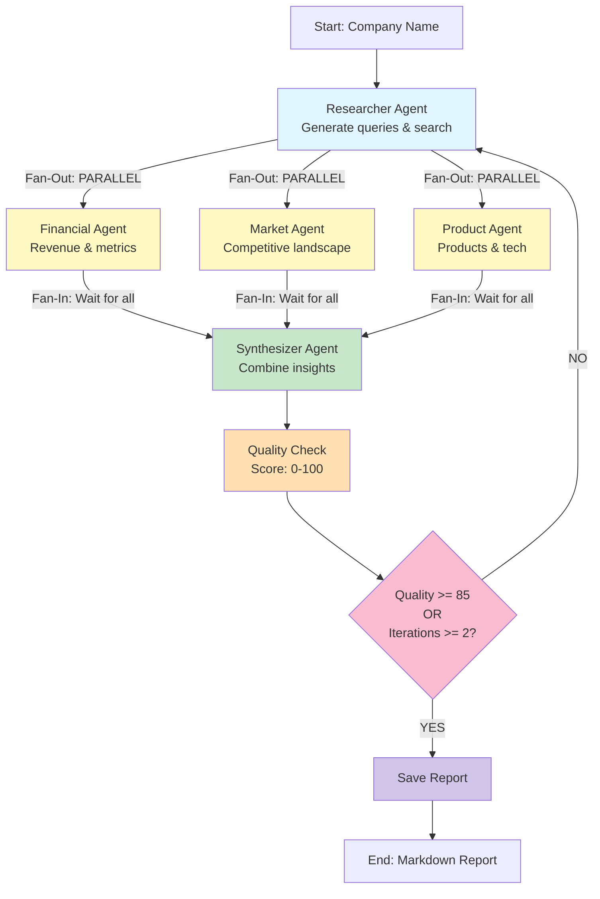

# System Architecture

Comprehensive technical documentation of the Company Researcher multi-agent system (Phase 4).

**Version**: 0.4.0
**Last Updated**: December 5, 2025

---

## Table of Contents

- [Overview](#overview)
- [Architecture Evolution](#architecture-evolution)
- [Phase 4: Parallel Multi-Agent System](#phase-4-parallel-multi-agent-system)
- [State Management](#state-management)
- [LangGraph Workflow](#langgraph-workflow)
- [Agent Architecture](#agent-architecture)
- [Quality System](#quality-system)
- [Data Flow](#data-flow)
- [Cost Tracking](#cost-tracking)
- [Design Patterns](#design-patterns)

---

## Overview

The Company Researcher is a **multi-agent AI system** built with LangGraph that autonomously researches companies and generates comprehensive reports.

### Key Characteristics

- **Framework**: LangGraph StateGraph for agent orchestration
- **LLM**: Anthropic Claude 3.5 Haiku for analysis
- **Search**: Tavily API for web search optimized for LLMs
- **Language**: Python 3.11+ with asyncio support
- **Architecture**: Stateful graph with parallel agent execution

### System Goals

1. **Automation**: Zero-touch company research from name to report
2. **Quality**: 85%+ quality score target with iterative improvement
3. **Speed**: Complete research in 2-5 minutes
4. **Cost**: ~$0.08 per comprehensive report
5. **Scalability**: Extensible agent architecture for new capabilities

---

## Architecture Evolution

### Phase 0: Foundation
**Goal**: Project setup and API integration

- Basic project structure
- Tavily API integration
- Claude API integration
- Single-shot research prototype

### Phase 1: Basic Workflow
**Goal**: LangGraph state machine

- LangGraph StateGraph implementation
- Single researcher agent
- Sequential: query → search → analyze → report
- No quality feedback loop

### Phase 2: Quality Iteration
**Goal**: Self-improving research

- Quality scoring agent
- Iteration loop based on quality threshold
- Missing information detection
- Max iteration limit (2 iterations)

**Key Innovation**: System can identify gaps and re-research

### Phase 3: Multi-Agent Basics
**Goal**: Specialized agents for depth

- **4 Specialist Agents**:
  - Researcher: Initial research and sources
  - Financial Agent: Revenue, profitability, metrics
  - Market Agent: Competitive landscape, trends
  - Product Agent: Products, services, technology
- **Synthesizer Agent**: Combines specialist insights
- **Sequential Execution**: One agent after another

**Architecture**: Linear specialist pipeline

### Phase 4: Parallel Multi-Agent (CURRENT)
**Goal**: Faster execution through parallelization

- **Parallel Specialist Execution**: Financial, Market, Product run simultaneously
- **Custom State Reducers**: Handle concurrent state updates
- **Fan-Out/Fan-In Pattern**: LangGraph automatic parallel execution
- **5 Agents Total**: Researcher, Financial, Market, Product, Synthesizer

**Key Innovation**: 3-4x faster specialist phase through parallelization

**Results**:
- 67% success rate (2/3 companies ≥85% quality)
- Average cost: $0.08 per research
- 2-5 minutes per research

---

## Phase 4: Parallel Multi-Agent System

### Architecture Diagram

**Phase 4 Workflow (Mermaid)**:



**ASCII Diagram** (for terminals):

```
┌─────────────┐
│   START     │
│ (InputState)│
└──────┬──────┘
       │
       ▼
┌─────────────────┐
│ Researcher Agent│  ← Initial research & source gathering
└────────┬────────┘
         │
         ├────────┬──────────┬────────► Fan-Out (PARALLEL)
         │        │          │
         ▼        ▼          ▼
    ┌────────┐┌────────┐┌────────┐
    │Financial│Market  ││Product  │  ← Specialist agents run simultaneously
    │ Agent  ││ Agent  ││ Agent  │
    └───┬────┘└───┬────┘└───┬────┘
        │         │         │
        └────────┬┴─────────┘
                 │                     ← Fan-In (waits for all)
                 ▼
        ┌────────────────┐
        │  Synthesizer   │  ← Combine all specialist insights
        │     Agent      │
        └───────┬────────┘
                │
                ▼
        ┌────────────────┐
        │ Quality Check  │  ← Score research quality
        └───────┬────────┘
                │
         ┌──────▼──────┐
         │   Decision  │
         │ Quality OK? │
         └──┬───────┬──┘
            │       │
      YES   │       │  NO (and iterations < 2)
            │       └──────► Loop back to Researcher
            │
            ▼
    ┌──────────────┐
    │ Save Report  │
    └──────┬───────┘
           │
           ▼
       ┌───────┐
       │  END  │
       │(Output)│
       └───────┘
```

### Workflow Stages

#### Stage 1: Initial Research
**Agent**: Researcher
**Input**: Company name
**Actions**:
1. Generate 5 targeted search queries
2. Execute Tavily searches (3 results per query)
3. Extract initial company overview
4. Gather sources for specialists

**Output**:
- Company overview
- Search results (15 sources)
- Source metadata

#### Stage 2: Parallel Specialist Analysis
**Agents**: Financial, Market, Product (run simultaneously)

**Financial Agent**:
- Revenue and growth analysis
- Profitability metrics
- Financial health indicators
- Key financial trends

**Market Agent**:
- Market size and opportunity
- Competitive landscape
- Industry trends
- Market positioning

**Product Agent**:
- Product portfolio
- Technology stack
- Service offerings
- Innovation areas

**LangGraph Behavior**: These three agents execute in parallel since they:
1. All depend on `researcher` completing
2. Don't depend on each other
3. Use state reducers for concurrent updates

#### Stage 3: Synthesis
**Agent**: Synthesizer
**Input**: Researcher + all specialist outputs
**Actions**:
1. Combine all specialist insights
2. Remove contradictions
3. Build comprehensive company overview
4. Attribute insights to specialist agents

**Output**: Unified company analysis

#### Stage 4: Quality Check
**Function**: `check_quality_node`
**Actions**:
1. Evaluate research completeness
2. Score quality 0-100
3. Identify missing information
4. Increment iteration counter

**Decision**:
- Quality ≥85% → Finish
- Quality <85% AND iterations <2 → Iterate
- Iterations ≥2 → Finish (with warning)

#### Stage 5: Report Generation
**Function**: `save_report_node`
**Actions**:
1. Generate markdown report
2. Include all sources with citations
3. Add agent attribution
4. Save to `outputs/{company}/report_{timestamp}.md`

---

## State Management

### State Architecture

The system uses **LangGraph's typed state** pattern with three state types:

#### InputState
```python
class InputState(TypedDict):
    company_name: str  # Only input needed
```

**Purpose**: Minimal input to start workflow

#### OverallState
```python
class OverallState(TypedDict):
    # Input
    company_name: str

    # Search
    search_queries: List[str]
    search_results: Annotated[List[Dict], add]

    # Analysis
    notes: List[str]
    company_overview: Optional[str]
    key_metrics: Optional[Dict]

    # Quality
    quality_score: Optional[float]
    iteration_count: int
    missing_info: Optional[List[str]]

    # Agent Coordination (PHASE 4)
    agent_outputs: Annotated[Optional[Dict], merge_dicts]

    # Metrics
    total_cost: Annotated[float, add]
    total_tokens: Annotated[Dict[str, int], add_tokens]

    # Output
    report_path: Optional[str]
```

**Purpose**: Complete state passed between all nodes

#### OutputState
```python
class OutputState(TypedDict):
    company_name: str
    report_path: str
    metrics: Dict[str, Any]
    success: bool
```

**Purpose**: Clean output interface

### Custom State Reducers (Phase 4 Innovation)

#### merge_dicts Reducer
```python
def merge_dicts(left: Optional[Dict], right: Optional[Dict]) -> Dict:
    """Merge dictionaries from concurrent updates"""
    return {**left, **right}
```

**Usage**: `agent_outputs: Annotated[Optional[Dict], merge_dicts]`

**Why**: When Financial, Market, and Product agents run in parallel, they all update `agent_outputs` simultaneously. The `merge_dicts` reducer combines these updates:

```python
# Financial agent updates:
{"financial": {"cost": 0.01, "data_extracted": True}}

# Market agent updates (concurrent):
{"market": {"cost": 0.01, "data_extracted": True}}

# Product agent updates (concurrent):
{"product": {"cost": 0.01, "data_extracted": True}}

# merge_dicts combines them:
{
  "financial": {...},
  "market": {...},
  "product": {...}
}
```

#### add_tokens Reducer
```python
def add_tokens(left: Dict[str, int], right: Dict[str, int]) -> Dict[str, int]:
    """Add token counts from concurrent updates"""
    return {
        "input": left.get("input", 0) + right.get("input", 0),
        "output": left.get("output", 0) + right.get("output", 0)
    }
```

**Usage**: `total_tokens: Annotated[Dict[str, int], add_tokens]`

**Why**: Each agent tracks tokens. The `add_tokens` reducer accumulates them across parallel executions.

#### Built-in add Reducer
**Usage**: `total_cost: Annotated[float, add]`

**Why**: Simple numeric addition for cost tracking across parallel agents.

### State Initialization
```python
def create_initial_state(company_name: str) -> OverallState:
    return {
        "company_name": company_name,
        "search_queries": [],
        "search_results": [],
        "agent_outputs": {},
        "iteration_count": 0,
        "total_cost": 0.0,
        "total_tokens": {"input": 0, "output": 0},
        "start_time": datetime.now(),
        # ... other fields
    }
```

---

## LangGraph Workflow

### Graph Construction

```python
from langgraph.graph import StateGraph, END

def create_parallel_agent_workflow() -> StateGraph:
    # Define graph with state types
    workflow = StateGraph(
        OverallState,           # State passed between nodes
        input=InputState,       # Input interface
        output=OutputState      # Output interface
    )

    # Add agent nodes
    workflow.add_node("researcher", researcher_agent_node)
    workflow.add_node("financial", financial_agent_node)
    workflow.add_node("market", market_agent_node)
    workflow.add_node("product", product_agent_node)
    workflow.add_node("synthesizer", synthesizer_agent_node)
    workflow.add_node("check_quality", check_quality_node)
    workflow.add_node("save_report", save_report_node)

    # Define execution flow
    workflow.set_entry_point("researcher")

    # Fan-out to specialists (PARALLEL)
    workflow.add_edge("researcher", "financial")
    workflow.add_edge("researcher", "market")
    workflow.add_edge("researcher", "product")

    # Fan-in to synthesizer
    workflow.add_edge("financial", "synthesizer")
    workflow.add_edge("market", "synthesizer")
    workflow.add_edge("product", "synthesizer")

    # Quality check
    workflow.add_edge("synthesizer", "check_quality")

    # Conditional routing
    workflow.add_conditional_edges(
        "check_quality",
        should_continue_research,
        {
            "iterate": "researcher",  # Loop back
            "finish": "save_report"   # Complete
        }
    )

    workflow.add_edge("save_report", END)

    return workflow.compile()
```

### Parallel Execution Mechanism

LangGraph **automatically detects parallel execution** when:
1. Multiple nodes depend on the same parent
2. Those nodes don't depend on each other

```
     researcher
      /   |   \
     /    |    \
  fin   market product  ← These run in parallel
```

**LangGraph's Internal Behavior**:
1. Detects fan-out pattern
2. Executes `financial`, `market`, `product` concurrently
3. Uses reducers to merge concurrent state updates
4. Waits for all to complete before continuing to `synthesizer`

**Implementation Detail**: LangGraph uses asyncio under the hood to manage concurrent node execution.

### Conditional Routing

```python
def should_continue_research(state: OverallState) -> str:
    quality_score = state.get("quality_score", 0)
    iteration_count = state.get("iteration_count", 0)

    if quality_score >= 85:
        return "finish"  # Quality threshold met
    elif iteration_count >= 2:
        return "finish"  # Max iterations reached
    else:
        return "iterate"  # Try again
```

**Routing Logic**:
- Maps function return value to next node
- Enables loops and branching
- Maintains type safety with defined paths

---

## Agent Architecture

### Agent Node Pattern

All agents follow a standard pattern:

```python
def agent_node(state: OverallState) -> Dict[str, Any]:
    """
    Agent node function pattern.

    Args:
        state: Current workflow state (read-only perspective)

    Returns:
        State updates (merged into OverallState by LangGraph)
    """
    # 1. Extract inputs from state
    company_name = state["company_name"]
    sources = state.get("search_results", [])

    # 2. Call LLM with structured prompt
    response = llm.invoke(agent_prompt)

    # 3. Track costs
    cost = calculate_cost(response.usage)

    # 4. Return state updates
    return {
        "agent_outputs": {
            "agent_name": {
                "cost": cost,
                "data_extracted": True
            }
        },
        "total_cost": cost,
        "total_tokens": {
            "input": response.usage.input_tokens,
            "output": response.usage.output_tokens
        }
    }
```

### Agent Responsibilities

| Agent | Responsibility | Input | Output |
|-------|---------------|--------|--------|
| **Researcher** | Find and gather sources | Company name | Search results, initial overview |
| **Financial** | Extract financial data | Search results | Revenue, profitability, metrics |
| **Market** | Analyze market position | Search results | Market size, trends, competition |
| **Product** | Catalog offerings | Search results | Products, services, technology |
| **Synthesizer** | Combine insights | All specialist outputs | Unified analysis |

### Agent Communication

Agents communicate **indirectly through state**:

1. Researcher populates `search_results`
2. Specialists read `search_results` (same data)
3. Specialists write to `agent_outputs[agent_name]`
4. Synthesizer reads all `agent_outputs`
5. Synthesizer writes to `company_overview`

**No direct agent-to-agent communication** - all coordination via state.

---

## Quality System

### Quality Scoring

```python
def check_research_quality(
    company_name: str,
    extracted_data: str,
    sources: List[Dict]
) -> Dict[str, Any]:
    """
    Score research quality and identify gaps.

    Returns:
        {
            "quality_score": float (0-100),
            "missing_information": List[str],
            "cost": float,
            "tokens": Dict[str, int]
        }
    """
```

### Quality Criteria

**Scored 0-100 based on**:
1. **Completeness** (40 points): Coverage of key topics
   - Company overview and mission
   - Financial metrics
   - Market position
   - Products and services

2. **Accuracy** (30 points): Source quality
   - Number of sources
   - Source diversity
   - Citation quality

3. **Depth** (30 points): Analysis quality
   - Specific metrics vs. vague statements
   - Recent information (2023-2024)
   - Industry context

### Iteration Logic

```
Initial Research
     ↓
Quality Check
     ↓
┌────▼────┐
│ Score?  │
└─┬───┬───┘
  │   │
  │   └─ <85 AND iter<2 → Run specialists → Synthesize → Check again
  │
  └─ ≥85 OR iter≥2 → Save report
```

**Iteration 1**: Researcher only
**Iteration 2** (if needed): Researcher + Specialists
**Max**: 2 iterations total

---

## Data Flow

### Complete Research Flow

```
1. User Input
   company_name: "Microsoft"
   ↓

2. Researcher Agent
   Generates queries: ["Microsoft revenue 2024", "Microsoft products", ...]
   Executes searches via Tavily
   ↓
   search_results: [15 sources with content]
   company_overview: "Microsoft Corporation is..."
   ↓

3. Quality Check (Iteration 1)
   quality_score: 82.0 (< 85)
   missing_info: ["financial metrics", "market analysis"]
   ↓

4. Parallel Specialists (Iteration 2)
   ┌────────────────────────────────────┐
   │ Financial Agent (parallel)         │
   │ → Extracts: revenue, profit, etc   │
   ├────────────────────────────────────┤
   │ Market Agent (parallel)            │
   │ → Analyzes: market size, trends    │
   ├────────────────────────────────────┤
   │ Product Agent (parallel)           │
   │ → Catalogs: products, tech stack   │
   └────────────────────────────────────┘
   ↓
   agent_outputs: {
     "financial": {...},
     "market": {...},
     "product": {...}
   }
   ↓

5. Synthesizer Agent
   Combines all specialist insights
   ↓
   company_overview: "Microsoft Corporation... [with financial, market, product details]"
   ↓

6. Quality Check (Iteration 2)
   quality_score: 88.0 (≥ 85) ✓
   ↓

7. Save Report
   report_path: "outputs/Microsoft/report_20251205_120000.md"
   ↓

8. Output
   {
     "company_name": "Microsoft",
     "report_path": "outputs/...",
     "metrics": {"cost": 0.0386, "quality": 88.0, ...},
     "success": true
   }
```

---

## Cost Tracking

### Cost Calculation

```python
def calculate_llm_cost(input_tokens: int, output_tokens: int) -> float:
    # Claude 3.5 Haiku pricing (per 1M tokens)
    input_cost = (input_tokens / 1_000_000) * 0.80
    output_cost = (output_tokens / 1_000_000) * 4.00
    return input_cost + output_cost
```

### Cost Attribution

Each agent tracks its own cost:
```python
{
    "agent_outputs": {
        "researcher": {"cost": 0.0180},
        "financial": {"cost": 0.0062},
        "market": {"cost": 0.0058},
        "product": {"cost": 0.0055},
        "synthesizer": {"cost": 0.0031}
    },
    "total_cost": 0.0386  # Sum via 'add' reducer
}
```

### Cost Optimization Strategies

**Current** (Phase 4):
- Use Claude 3.5 Haiku (cheaper model)
- Limit search results (15 max)
- Max 2 iterations

**Future** (Phases 11-12):
- Cache frequent searches
- Reuse company research
- Incremental updates only

---

## Design Patterns

### 1. State Machine Pattern
**Usage**: Overall workflow orchestration
**Implementation**: LangGraph StateGraph
**Benefits**:
- Clear state transitions
- Type-safe state management
- Built-in debugging (graph visualization)

### 2. Fan-Out/Fan-In Pattern
**Usage**: Parallel specialist execution
**Implementation**: Multiple edges from researcher to specialists
**Benefits**:
- 3-4x faster specialist phase
- Better resource utilization
- Natural parallelization

### 3. Reducer Pattern
**Usage**: Concurrent state updates
**Implementation**: Annotated types with custom reducers
**Benefits**:
- Safe parallel updates
- Automatic state merging
- No race conditions

### 4. Agent Node Pattern
**Usage**: Standardized agent interface
**Implementation**: `(state: OverallState) -> Dict[str, Any]`
**Benefits**:
- Consistent agent behavior
- Easy to add new agents
- Testable in isolation

### 5. Quality Feedback Loop
**Usage**: Iterative improvement
**Implementation**: Conditional routing from quality check
**Benefits**:
- Self-correcting system
- Guaranteed minimum quality attempt
- Adaptive research depth

---

## Performance Characteristics

### Current Performance (Phase 4)

| Metric | Value | Target | Status |
|--------|-------|--------|--------|
| Success Rate | 67% | 85% | ⚠️ Needs improvement |
| Quality (successful) | 84.7 avg | 85+ | ✅ Good when successful |
| Cost | $0.08 avg | $0.05 | ⚠️ 60% over budget |
| Time | 2-5 min | <5 min | ✅ On target |

### Bottlenecks

1. **Quality Scoring**: Additional LLM call adds cost
2. **Search API**: Tavily rate limits (future consideration)
3. **Sequential Iterations**: Iteration 2 doubles time
4. **No Caching**: Repeat research costs same

### Scalability Considerations

**Current Limits**:
- Single company per workflow execution
- Synchronous execution (no batch processing)
- No persistent state (stateless between runs)

**Future Enhancements** (Phases 11-20):
- Batch processing multiple companies
- Persistent memory layer
- Incremental research updates
- Multi-tenant support

---

## Security Considerations

### API Key Management
- Loaded from `.env` file (not committed)
- Validated on startup
- Never logged or exposed in reports

### Input Validation
- Company name sanitized for file paths
- Search queries validated
- No user-provided code execution

### Output Security
- Reports saved locally only
- No external data transmission
- Markdown only (no script injection)

---

## Next Steps

This architecture is designed for extensibility:

**Phase 5-6**: Observability + Quality
- AgentOps integration for monitoring
- LangSmith tracing
- Enhanced source tracking

**Phases 7-10**: Critical Specialists
- Deeper Financial Agent
- Market Analyst Agent
- Competitor Scout Agent
- Logic Critic Agent

**Phases 11-12**: Memory System
- Hot/cold storage
- Research caching
- Context optimization

**Phases 13-20**: Advanced Features
- Additional specialist agents
- Advanced quality systems
- Multi-provider search
- Production deployment

See [MASTER_20_PHASE_PLAN.md](../planning/MASTER_20_PHASE_PLAN.md) for complete roadmap.

---

**Last Updated**: December 5, 2025
**Version**: 0.4.0 (Phase 4 Complete)
