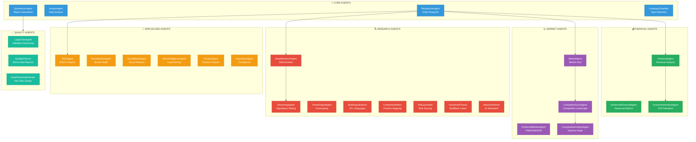

# Agent Architecture

```mermaid
graph TB
    %% Agent Organization Diagram

    subgraph CORE["🎯 CORE AGENTS"]
        R[ResearcherAgent<br/>Initial Research]
        A[AnalystAgent<br/>Data Analysis]
        S[SynthesizerAgent<br/>Report Generation]
        CC[CompanyClassifier<br/>Type Detection]
    end

    subgraph FINANCIAL["💰 FINANCIAL AGENTS"]
        FA[FinancialAgent<br/>Revenue Analysis]
        EFA[EnhancedFinancialAgent<br/>Advanced Metrics]
        IA[InvestmentAnalystAgent<br/>DCF/Valuation]
    end

    subgraph MARKET["📈 MARKET AGENTS"]
        MA[MarketAgent<br/>Market Size]
        EMA[EnhancedMarketAgent<br/>TAM/SAM/SOM]
        CS[CompetitorScoutAgent<br/>Competitive Landscape]
        CAA[ComparativeAnalystAgent<br/>Head-to-Head]
    end

    subgraph RESEARCH["🔍 RESEARCH AGENTS"]
        DR[DeepResearchAgent<br/>Multi-iteration]
        RA[ReasoningAgent<br/>Hypothesis Testing]
        TA[TrendAnalystAgent<br/>Forecasting]
        ML[MultilingualSearch<br/>10+ Languages]
        CMG[CompetitiveMatrix<br/>Position Mapping]
        RQ[RiskQuantifier<br/>Risk Scoring]
        ITG[InvestmentThesis<br/>Bull/Bear Cases]
        NSA[NewsSentiment<br/>AI Sentiment]
    end

    subgraph SPECIALIZED["🎨 SPECIALIZED AGENTS"]
        ESG[ESGAgent<br/>E/S/G Analysis]
        BA[BrandAuditorAgent<br/>Brand Health]
        SMA[SocialMediaAgent<br/>Social Analysis]
        SI[SalesIntelligenceAgent<br/>Lead Scoring]
        PA[ProductAgent<br/>Product Analysis]
        RCA[RegulatoryAgent<br/>Compliance]
    end

    subgraph QUALITY["✅ QUALITY AGENTS"]
        LC[LogicCriticAgent<br/>Validates Reasoning]
        QE[QualityEnforcer<br/>Blocks Bad Reports]
        DT[DataThresholdChecker<br/>Min Data Quality]
    end

    %% Relationships
    R --> FA & MA & ESG
    FA --> IA
    MA --> CS --> CAA
    R --> DR --> RA
    S --> QUALITY

    classDef core fill:#3498db,stroke:#2980b9,color:#fff
    classDef financial fill:#27ae60,stroke:#1e8449,color:#fff
    classDef market fill:#9b59b6,stroke:#8e44ad,color:#fff
    classDef research fill:#e74c3c,stroke:#c0392b,color:#fff
    classDef specialized fill:#f39c12,stroke:#d68910,color:#fff
    classDef quality fill:#1abc9c,stroke:#16a085,color:#fff

    class R,A,S,CC core
    class FA,EFA,IA financial
    class MA,EMA,CS,CAA market
    class DR,RA,TA,ML,CMG,RQ,ITG,NSA research
    class ESG,BA,SMA,SI,PA,RCA specialized
    class LC,QE,DT quality

```
