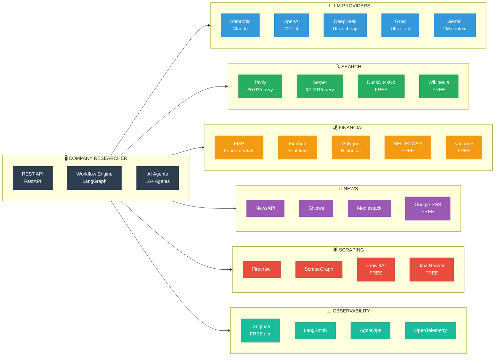

# External Integrations

```mermaid
graph LR
    %% External Integrations

    subgraph APP["🖥️ COMPANY RESEARCHER"]
        API[REST API<br/>FastAPI]
        WF[Workflow Engine<br/>LangGraph]
        AG[AI Agents<br/>16+ Agents]
    end

    subgraph LLM["🤖 LLM PROVIDERS"]
        ANT[Anthropic<br/>Claude]
        OAI[OpenAI<br/>GPT-4]
        DS[DeepSeek<br/>Ultra-cheap]
        GRQ[Groq<br/>Ultra-fast]
        GEM[Gemini<br/>2M context]
    end

    subgraph SEARCH["🔍 SEARCH"]
        TAV[Tavily<br/>$0.01/query]
        SER[Serper<br/>$0.001/query]
        DDG[DuckDuckGo<br/>FREE]
        WIKI[Wikipedia<br/>FREE]
    end

    subgraph FIN["💰 FINANCIAL"]
        FMP[FMP<br/>Fundamentals]
        FH[Finnhub<br/>Real-time]
        POL[Polygon<br/>Historical]
        SEC[SEC EDGAR<br/>FREE]
        YF[yfinance<br/>FREE]
    end

    subgraph NEWS["📰 NEWS"]
        NAPI[NewsAPI]
        GN[GNews]
        MS[Mediastack]
        GNRSS[Google RSS<br/>FREE]
    end

    subgraph SCRAPE["🕷️ SCRAPING"]
        FC[Firecrawl]
        SG[ScrapeGraph]
        C4AI[Crawl4AI<br/>FREE]
        JINA[Jina Reader<br/>FREE]
    end

    subgraph OBS["📊 OBSERVABILITY"]
        LF[Langfuse<br/>FREE tier]
        LS[LangSmith]
        AO[AgentOps]
        OT[OpenTelemetry]
    end

    APP --> LLM & SEARCH & FIN & NEWS & SCRAPE
    APP --> OBS

    classDef app fill:#2c3e50,stroke:#1a252f,color:#fff
    classDef llm fill:#3498db,stroke:#2980b9,color:#fff
    classDef search fill:#27ae60,stroke:#1e8449,color:#fff
    classDef fin fill:#f39c12,stroke:#d68910,color:#fff
    classDef news fill:#9b59b6,stroke:#8e44ad,color:#fff
    classDef scrape fill:#e74c3c,stroke:#c0392b,color:#fff
    classDef obs fill:#1abc9c,stroke:#16a085,color:#fff

    class API,WF,AG app
    class ANT,OAI,DS,GRQ,GEM llm
    class TAV,SER,DDG,WIKI search
    class FMP,FH,POL,SEC,YF fin
    class NAPI,GN,MS,GNRSS news
    class FC,SG,C4AI,JINA scrape
    class LF,LS,AO,OT obs

```
