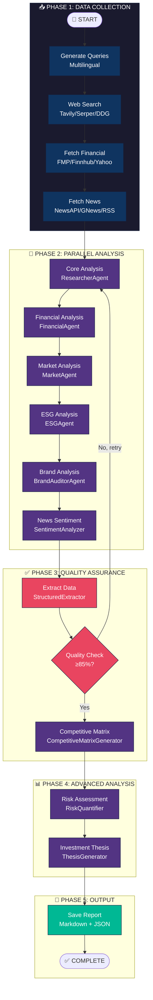

# Research Workflow

```mermaid
graph TD
    %% Styling
    classDef phase fill:#1a1a2e,stroke:#16213e,color:#fff
    classDef data fill:#0f3460,stroke:#16213e,color:#fff
    classDef analysis fill:#533483,stroke:#16213e,color:#fff
    classDef quality fill:#e94560,stroke:#16213e,color:#fff
    classDef output fill:#00b894,stroke:#16213e,color:#fff

    %% Phase 1: Data Collection
    subgraph P1["📥 PHASE 1: DATA COLLECTION"]
        START([🚀 START]) --> GQ[Generate Queries<br/>Multilingual]
        GQ --> SEARCH[Web Search<br/>Tavily/Serper/DDG]
        SEARCH --> FF[Fetch Financial<br/>FMP/Finnhub/Yahoo]
        FF --> FN[Fetch News<br/>NewsAPI/GNews/RSS]
    end

    %% Phase 2: Parallel Analysis
    subgraph P2["🔬 PHASE 2: PARALLEL ANALYSIS"]
        FN --> CA[Core Analysis<br/>ResearcherAgent]
        CA --> FA[Financial Analysis<br/>FinancialAgent]
        FA --> MA[Market Analysis<br/>MarketAgent]
        MA --> EA[ESG Analysis<br/>ESGAgent]
        EA --> BA[Brand Analysis<br/>BrandAuditorAgent]
        BA --> NS[News Sentiment<br/>SentimentAnalyzer]
    end

    %% Phase 3: Quality Assurance
    subgraph P3["✅ PHASE 3: QUALITY ASSURANCE"]
        NS --> ED[Extract Data<br/>StructuredExtractor]
        ED --> QC{Quality Check<br/>≥85%?}
        QC -->|No, retry| CA
        QC -->|Yes| CM
    end

    %% Phase 4: Advanced Analysis
    subgraph P4["📊 PHASE 4: ADVANCED ANALYSIS"]
        CM[Competitive Matrix<br/>CompetitiveMatrixGenerator]
        CM --> RA[Risk Assessment<br/>RiskQuantifier]
        RA --> IT[Investment Thesis<br/>ThesisGenerator]
    end

    %% Phase 5: Output
    subgraph P5["📄 PHASE 5: OUTPUT"]
        IT --> SR[Save Report<br/>Markdown + JSON]
        SR --> DONE([✅ COMPLETE])
    end

    %% Apply styles
    class P1 phase
    class GQ,SEARCH,FF,FN data
    class CA,FA,MA,EA,BA,NS analysis
    class ED,QC quality
    class CM,RA,IT analysis
    class SR output

```
